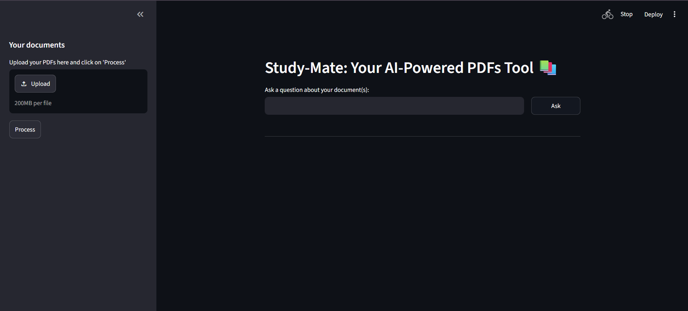
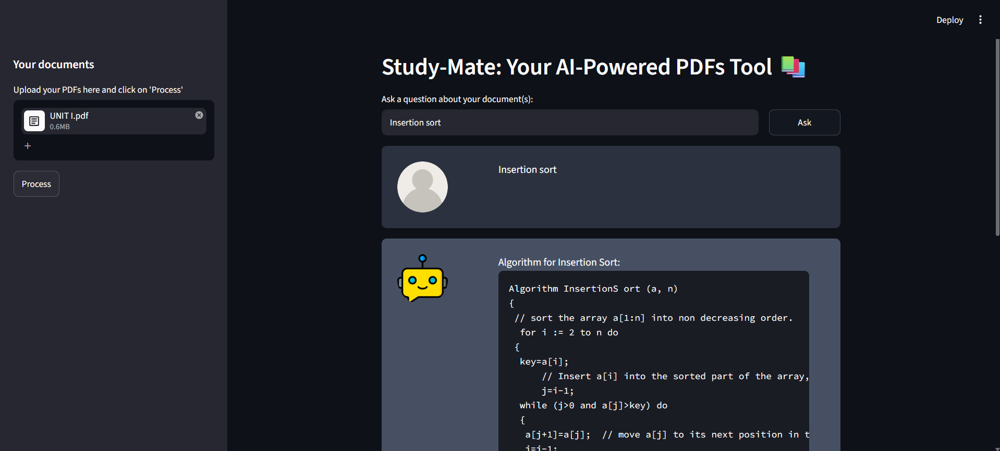
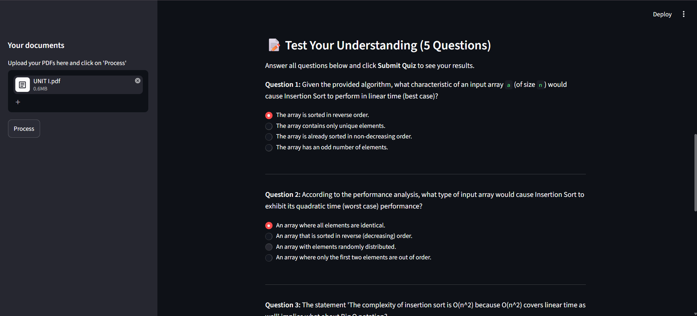
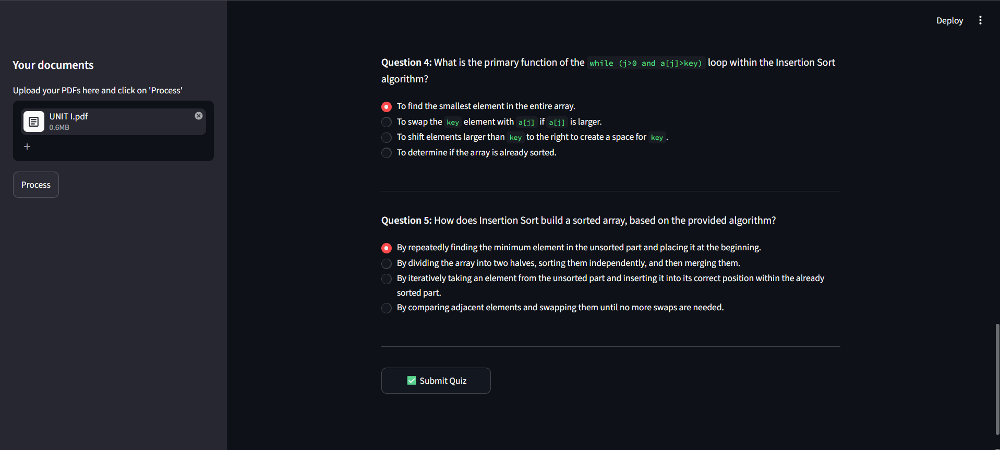
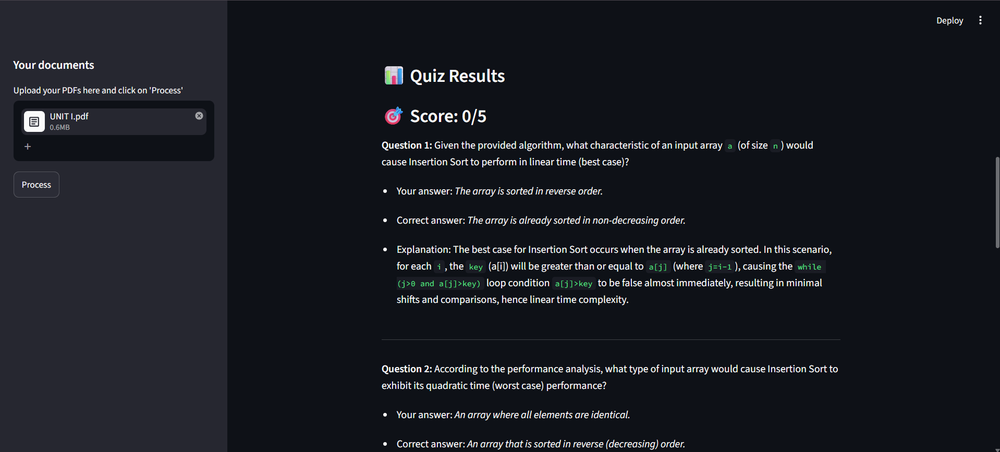
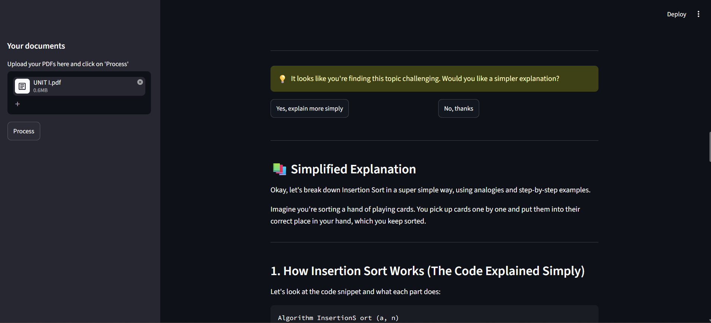
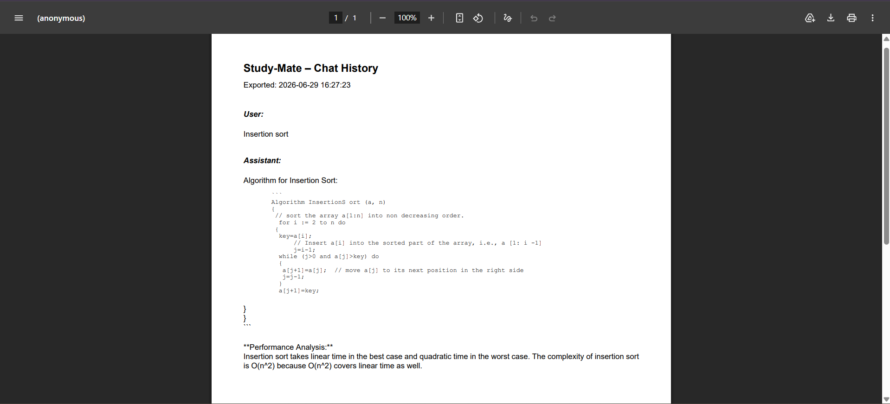

# 📚 Study-Mate

An AI-powered learning assistant that transforms static PDF documents into an interactive learning experience using Retrieval-Augmented Generation (RAG).

Instead of simply answering questions from PDFs, Study-Mate helps students **learn, practice, and revise** through AI-generated explanations, quizzes, adaptive learning, and chat export.

---

## 🚀 Features

- 📄 Upload and chat with multiple PDF documents
- 🔍 Semantic search using FAISS Vector Database
- 🤖 Context-aware question answering with Google Gemini
- 💬 Conversational memory for follow-up questions
- 🧠 AI-generated quizzes based on the latest explanation
- 📊 Automatic quiz evaluation and scoring
- 💡 Simplified explanations for difficult topics
- 📥 Export complete chat history as a PDF
- 🔄 Automatic fallback to Hugging Face when Gemini is unavailable

---

## 🏗️ Architecture

```
                 PDFs
                   │
                   ▼
            Text Extraction
                   │
                   ▼
             Text Chunking
                   │
                   ▼
         HuggingFace Embeddings
                   │
                   ▼
             FAISS Vector DB
                   │
                   ▼
        Relevant Context Retrieval
                   │
                   ▼
               Gemini AI
                   │
        ┌──────────┴──────────┐
        │                     │
        ▼                     ▼
  Question Answering      Quiz Generation
        │                     │
        └──────────┬──────────┘
                   ▼
            Adaptive Learning
```

---

## 🛠️ Tech Stack

### Frontend
- Streamlit

### AI
- Google Gemini 2.5 Flash
- Hugging Face (Embeddings)
- LangChain

### Vector Database
- FAISS

### Embedding Model
- sentence-transformers/all-MiniLM-L6-v2

### PDF Processing
- PyPDF2

### PDF Export
- ReportLab

---

## 📷 Screenshots

### Home Page



### AI Chat



### Quiz Generation






### PDF Export



---

## ⚙️ Installation

Clone the repository

```bash
git clone https://github.com/Pravallika-nvs/Study_Mate.git
cd Study_Mate
```

Create a virtual environment

```bash
python -m venv venv
```

Activate the environment

Windows

```bash
venv\Scripts\activate
```

Install dependencies

```bash
pip install -r requirements.txt
```

Create a `.env` file

```env
GOOGLE_API_KEY=YOUR_GOOGLE_API_KEY
HUGGINGFACEHUB_API_TOKEN=YOUR_HUGGINGFACE_TOKEN
```

Run the application

```bash
streamlit run app.py
```

---

## 🎯 Future Improvements

- Flashcard generation
- Save important notes
- Personalized revision sheets
- Multi-language support
- Study progress dashboard
- OCR support for scanned PDFs

---

## 👩‍💻 Author

**Pravallika N. V. S.**

Computer Science Engineering Student

Passionate about AI, Full Stack Development, and building technology that enhances education.

GitHub:
https://github.com/Pravallika-nvs

---

## ⭐ If you found this project useful, consider giving it a star!